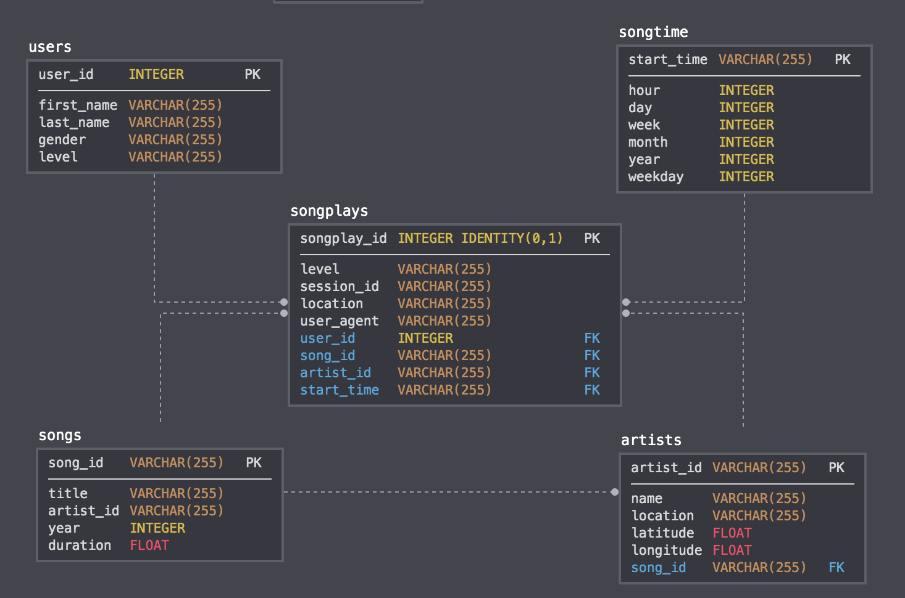

Overview
---
This project is to build the ETL pipeline whoch extracts data from s3, stage the data to aws RedShift and transfer it into different dimesion tables. 

This is the database schema design and a star schema has been used:



ETL Pipeline:
---
1. create necessary tables which includes staging tables and dimension tables. Following tables have been created
```
staging_events // Its purpose is to store the raw events data from s3
staging_songs // Its purpose is to store the raw songs data from s3
song_plays //This is the fact table which will store the info for user_id, song_id, artist_id and these fact info
users //The purpose of this table is to store the user dimension data
songs //The purpose of this table is to store the song dimension data
artists //The purpose of this table is to store the artist dimension data
time //The purpose of this table is to store the time dimension data
```
2. extract data from s3 to staging tables. Following copy has been used to copy data from s3 to staging_events table and staging_songs table
```
staging_events_copy = ("""copy staging_events from '{}'
 credentials 'aws_iam_role={}' 
 json '{}'
 """).format(config.get('S3','LOG_DATA'), 
             config.get('IAM_ROLE', 'ARN'), 
             config.get('S3','LOG_JSONPATH'))

staging_songs_copy = ("""
copy staging_songs from '{}' 
credentials 'aws_iam_role={}' 
json 'auto';
""").format(config["S3"]["SONG_DATA"], 
            config["IAM_ROLE"]["ARN"])
```
3. Extract data from staging tables to all kinds dimension tables

How to Run
---
In the terminal:
1. run python3 create_tables.py to create staging tables
2. run python3 etl.py to trigger the extract data from aws s3 to redshift staging table and also tranform the data from staging table to dimension tables